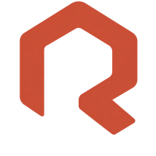

<p align="center">
  
</p>

<h1 align="center">Ruchoir</h1>

<p align="center"><em>A hive for all your work.</em></p>

<p align="center">
  A sovereign, open-core team workspace: real-time messaging and file sharing in one place.<br />
  A European alternative to Slack, Mattermost and Nextcloud, with a zero-loss import that migrates
  an existing Nextcloud or Mattermost instance in under two minutes.
</p>

## Why

- **Sovereign by design** - fully self-hostable, GDPR-first, no runtime dependency on any
  non-European service.
- **All-in-one** - messaging and files in a single, clean, professional workspace.
- **Painless migration** - an official export script runs on your existing Nextcloud/Mattermost
  server and produces an encrypted archive that Ruchoir imports without data loss.

## Features (MVP scope)

- Real-time messaging: channels (public/private), direct messages, threads, reactions, mentions,
  presence, full-text search.
- Files: uploads, folders, previews, message attachments, S3-compatible object storage.
- Accounts: authentication, roles, workspace and member management.
- Import: Nextcloud and Mattermost, via an official encrypted export.

## Tech stack

| Layer | Technology |
| --- | --- |
| API | Rust (axum, tokio) |
| Real-time | WebSocket with SSE fallback |
| Web | Next.js, React, TypeScript, Tailwind CSS (static export, served by the API) |
| Data | PostgreSQL, Valkey |
| Object storage | Garage (S3-compatible) |
| Auth | Native in the API (argon2id, server sessions, TOTP, passkeys) |
| Runtime | Docker Compose |

## Getting started

> The application stack is being built. This section will provide a one-command setup
> (`docker compose up`) as the services land.

Prerequisites: Docker and Docker Compose.

```bash
git clone https://github.com/theovil1/ruchoir.git
cd ruchoir
docker compose up
```

## Project structure

```
apps/api/                Rust backend (axum/tokio)
apps/web/                Next.js frontend
packages/importer/       Nextcloud/Mattermost import tooling
packages/design-system/  Shared React components and design tokens
migrations/              Versioned SQL migrations
docs/                    Technical documentation
```

## Development

- Backend: `cargo fmt`, `cargo clippy`, `cargo test` in `apps/api/`.
- Web: `pnpm lint`, `pnpm test`, `pnpm build` in `apps/web/`.
- Responsive audit: `pnpm audit:responsive` in `apps/web/` (against a running dev server) sweeps the
  UI across a wide viewport matrix and reports layout breakage. See
  [`apps/web/tools/responsive-audit/README.md`](apps/web/tools/responsive-audit/README.md).
- Commits follow [Conventional Commits](https://www.conventionalcommits.org/); branches use
  conventional naming (`feat/…`, `fix/…`, `chore/…`).

Contributors - including AI coding agents - should read [`AGENTS.md`](AGENTS.md) first.

## License

Licensed under the **GNU Affero General Public License v3.0** (AGPLv3). See [`LICENSE`](LICENSE).
